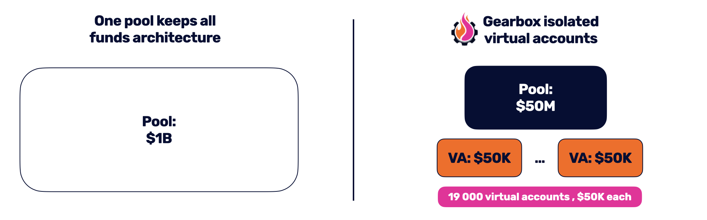

# Isolated Credit Accounts

The gearbox protocol is designed to provide a maximum level of security. To mitigate possible risks, it uses the following technologies:

* Isolated reusable credit accounts
* Virtual model and anomaly detection
* Flash loan attack protection
* Price oracle fluctuations alerts

### Isolated credit account

Each time when trader/farmer opens credit account, all these funds are keeped in isolated smart contract. It makes contract more hacker-proof than contract which keeps on funds on one contract

Potential hacker has 2 possibitilites for attack:

1\) Attack pool contract. As result, he could get available liquidity. However, pool contract doesn't interact directly with third party services. (On the picture - potential sum is $50M comparing with $1B on one pool approach)

2\) Attack a lot of credit accounts to get money from each of them. To do that, he should make a lot of similar transactions. This type of attack is less economic reasonable, cause each time attacker has to pay for gas. For more protection, Gearbox uses monitoring and anomaly detection system which is describe in next section. (On the picture: potential sum - $50K).
